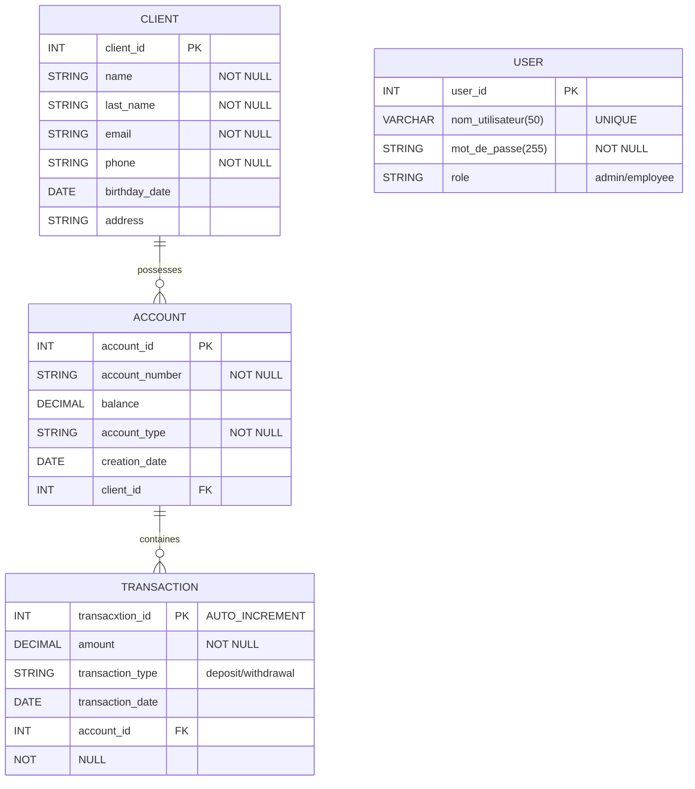

```mermaid
erDiagram
    CLIENT {
        INT client_id PK
        STRING name "NOT NULL"
        STRING last_name "NOT NULL"
        STRING email "NOT NULL"
        STRING phone "NOT NULL"
        DATE birthday_date
        STRING address
    }

 
 ACCOUNT {
        INT account_id PK
        STRING account_number "NOT NULL"
        DECIMAL balance
        STRING account_type "NOT NULL"
        DATE creation_date
        INT client_id FK
    }

 TRANSACTION {
        INT transacxtion_id PK "AUTO_INCREMENT"
        DECIMAL amount "NOT NULL"
        STRING transaction_type "deposit/withdrawal"
        DATE transaction_date
        INT account_id FK NOT NULL
    }
    
 USER {
        INT user_id PK
        VARCHAR nom_utilisateur(50) "UNIQUE"
        STRING mot_de_passe(255) "NOT NULL"
        STRING role "admin/employee"
    }

CLIENT ||--o{ACCOUNT  : "possesses"
ACCOUNT ||--O{TRANSACTION : "containes"


```